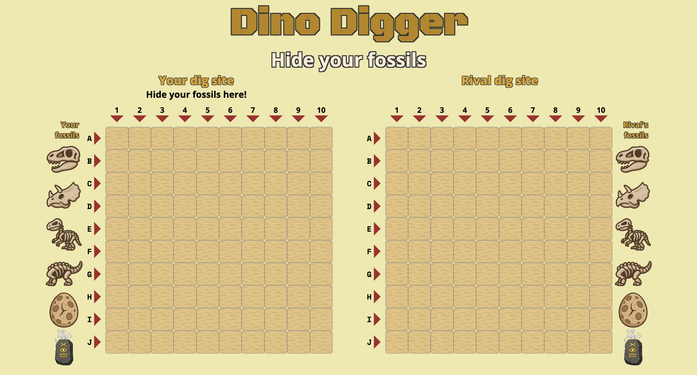
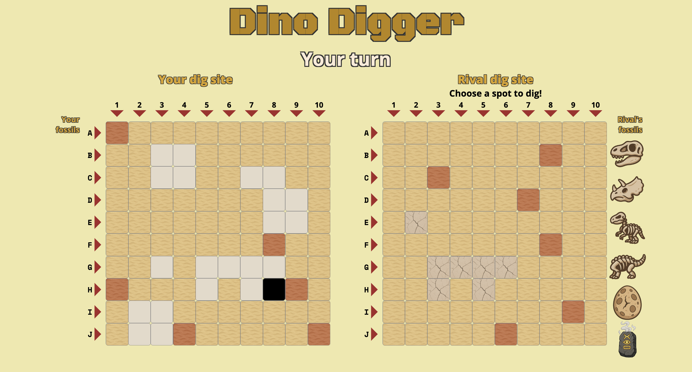

# Dino-Digger
A rival paleontologist wants to steal your precious fossils! Hide your artefacts from them, then dig theirs up before they get to chance to destroy your rare dinosaurs.

## Screenshots

## Technologies Used

- JavaScript
- HTML
- CSS

## Getting Started
[Click to Play Dino-Digger!](https://cyrilh714.github.io/Dino-Digger/)

## How to play 
1. Drag and drop your fossils from the column on the left onto your board to hide them.

2. Once all of your fossils have been buried, take turns with your rival digging on each other's boards.
    If the clicked square turn up red, you missed! No fossil here so your turn ends.
    If the clicked square shows cracked bone, success! You hit your rival's fossil. Dig again.
    Be careful not to hit the cursed fossil! This will make you lose your turn and will dig spaces on your own board too.

 The game ends when all of your fossils, or all of your rival's fossils, have been dug up.

 To reset the game, click the Play again? button.

## Next Steps
- Add an animation for digging, including sound effects.
- Make a fossil value where transparency increases after placeRivalFossils
- Allow rotation of fossils

### [Give Dino-Digger a try?](https://cyrilh714.github.io/Dino-Digger/)

